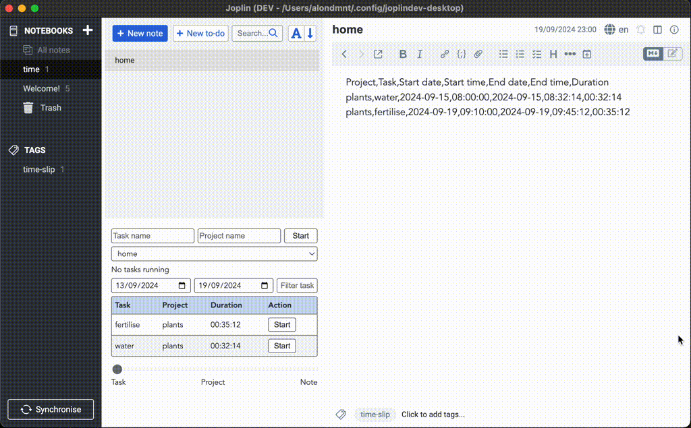

# ⏱️ Time Slip

Time Slip is a [Joplin](https://joplinapp.org/) plugin that allows you to track the time you spend on tasks.

## Features

- Run multiple concurrent timers and manage multiple time logs
- Sync completed and running tasks across devices (including mobile)
- Display summaries by date ranges, and aggregated by task, project, or note
- Logs are saved in Joplin notes in a simple-to-export, editable CSV format

