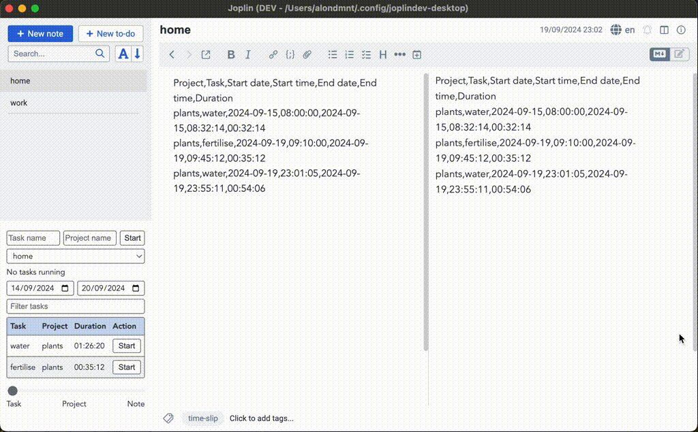

# ⏱️ Time Slip

Time Slip is a [Joplin](https://joplinapp.org/) plugin that allows you to track the time you spend on tasks.

## Features

- Run multiple concurrent timers and manage multiple time logs
- Sync completed and running tasks across devices (including mobile)
- Display summaries by date ranges, and aggregated by task, project, or note
- Logs are saved in Joplin notes in a simple-to-export, editable CSV format

## Usage

1. Create a new note and tag it with `time-slip`.
2. Make sure that the note is selected in the Time Slip panel (you may need to switch to a different note first).
3. Start a new timer by filling the task and project fields, and clicking the `Start` button. You may start multiple timers.
4. Click the `Stop` button to stop the timer.
5. The time log contains a table with entries for each ongoing or completed timer.
    - Edit the note to change any of the fields.
    - Select the default order of the log entries in the settings. You may also activate auto-sorting, so that edited entries are automatically resorted (or resort using `Note -> Sort Time Slip log`).
6. The panel displays a summary of completed timers.
    - Only entries in the selected date range are displayed.
    - Change the aggregation level by selecting task, project, or note.
    - Sort the table by clicking on the column headers.
    - Further filter the table using the search bar.
    - Copy the table to clipboard using `Note -> Copy Time slip summary`.

## Tips

- Convert time logs to Markdown tables using Joplin's [Paste Special plugin](https://joplinapp.org/plugins/plugin/com.coderrsid.pasteSpecial/)

